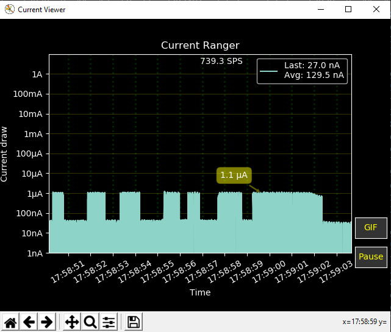

# CurrentViewer

CurrentViewer is a Python script that displays an interactive/live plot of the current draw as measured by LowePowerLab's CurrentRanger.

Example of CurrentViewer in action (live capture exported from the app itself):


Note: CurrentViewer is not a replacement for an oscilloscope, as the readings are done via the internal ADC in SAMD21 which has its limitations. But it might be more convenient way to use CurrentRanger. Sometimes the noise (Vpp) can be comparable with entry level oscilloscopes, but the measurements can be off: CurrentRanger has to be properly calibrated in order for the measurements to match what multimeter or oscilloscope displays.

## Features:
- Logaritmic scale, makes it easy to read any swings from 1 nanoamp to 1 amp. Works with CurrentRanger in AUTORANGE as well as manual mode. Note you can s
- Currently displayed:
    - SPS (Samples per Second) - how fast CurrentRanger sends samples over USB
    - Last measurement (noisy) 
    - Average of the view (slow). The window buffer is currently set to last 10K measurements - this is easy to extend if needed
    - point annoations (hover the mouse over a certain sample)
- It should be able to display as fast as the instrument can measure
- It automatically turns on streaming on the device (and if you use the new firmware feature with SMART AutoOff now the instrument will stay on as long as CurrentViewer is connected to it).
-
- It can save the chart/animation as .GIF - for a convenient way to publish measurements on the web


## Installation

Recommended environment is Python3 (tested with 3.6 and 3.8.5) with matplotlib installed. To install all the requirements automatically:

```
pip install -r requirements.txt
```
or 
```
pip install -r requirements.txt
```

## Running

First you need to identify the COM port CurrentRanger is plugged into (eg COM3 or /dev/ttyACM0). CurrentViewer was only tested with direct USB connection (might work with BlueTooth already - but needs validation). 

On Windows:
```
python current_viewer.py COM9
```

On Linux:
```
python current_viewer.py /dev/ttyACM0
```


If everything is working well you should see an image like this below (otherwise the console and current_viewer.log will have more information)

